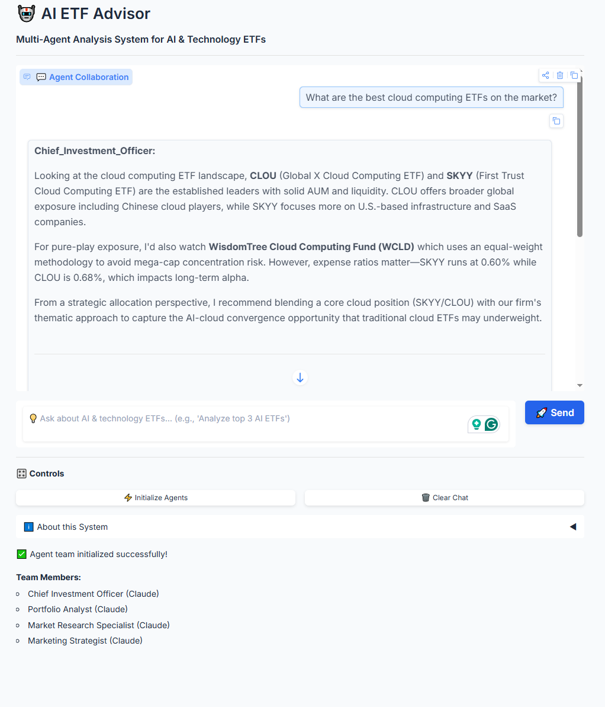

# Thematic ETF Advisor - Multi-Agent AI System

Multi-agent AI system for analyzing AI-focused ETFs, powered by Anthropic Claude and AutoGen.



## Quick Start

```bash
# Setup
python -m venv venv
venv\Scripts\activate  # Windows
pip install -r requirements.txt

# Configure (create .env file)
ANTHROPIC_API_KEY=your_key_here

# Run
python app.py
```

Visit `http://127.0.0.1:7860`

## Features

- **4 AI Agents**: CIO, Portfolio Analyst, Market Research, Marketing Strategist
- **Real-time**: Watch agents collaborate live
- **Claude-Powered**: All agents use Anthropic Claude
- **Demo-Optimized**: Quick, concise responses

## Project Structure

```
src/
├── agents/      # Agent definitions and prompts
├── config/      # LLM configuration
└── ui/          # Gradio web interface
```

## Attribution

Based on Dr. Ryan Ahmed's LLM Engineering course on Multi-Agent AI Systems with AutoGen.

**Developed by:** Arnaud Demes, CFA

## Disclaimer

Educational system only. Not financial advice.
