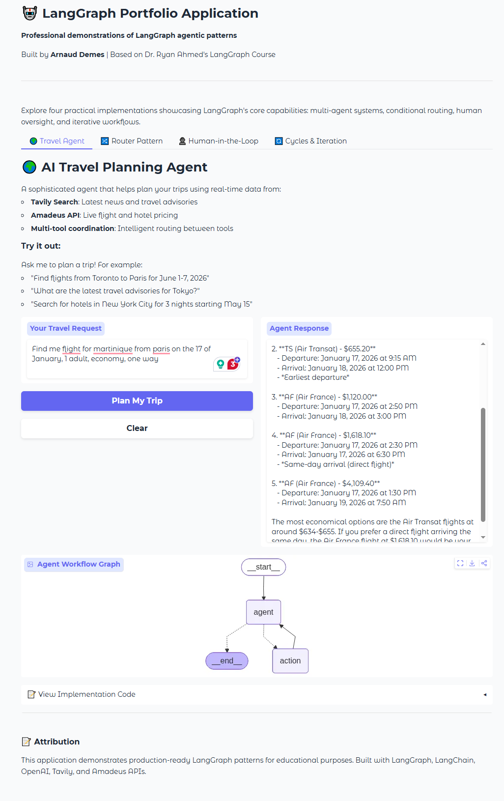
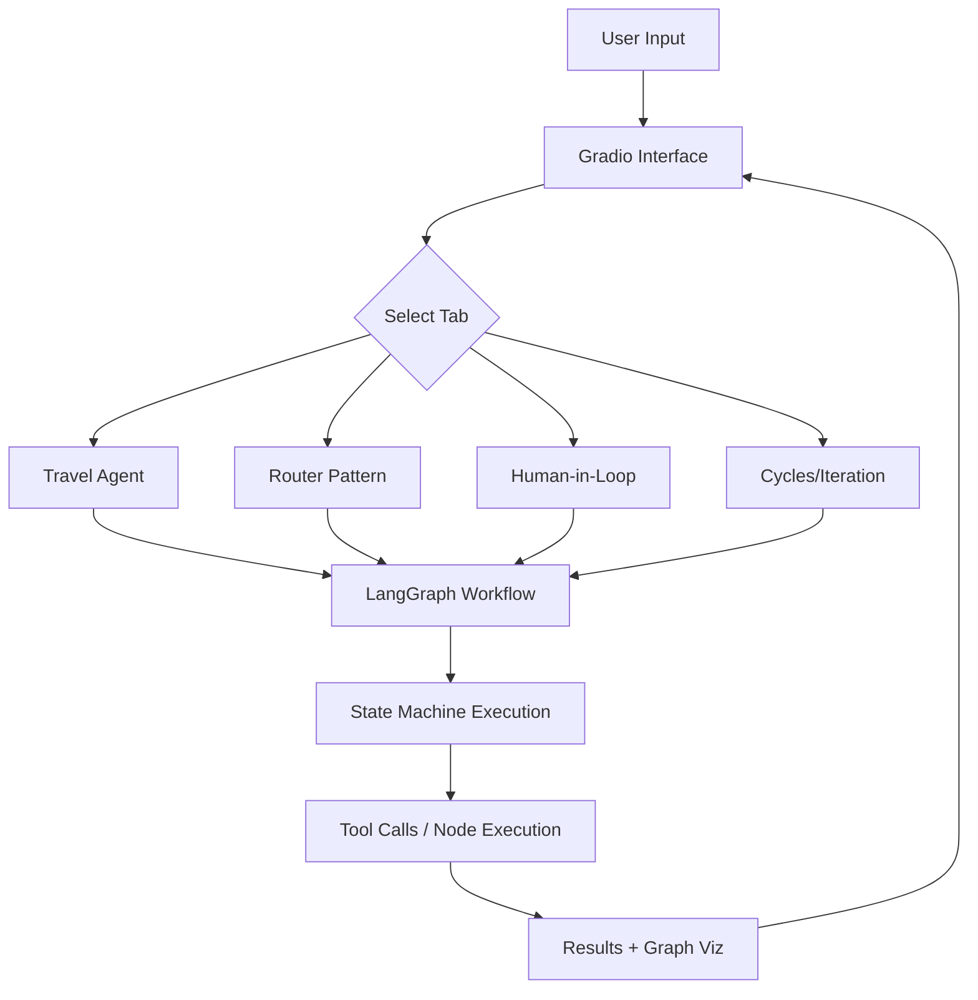

# 🤖 LangGraph Portfolio Application

A professional Gradio application demonstrating **LangGraph agentic patterns** through practical, working examples. Built as a portfolio piece to showcase AI engineering capabilities and understanding of multi-agent systems.

[](https://www.python.org/downloads/)
[](https://github.com/langchain-ai/langgraph)
[](https://gradio.app/)
[](LICENSE)



---

## 📋 Table of Contents

- [Overview](#overview)
- [Features](#features)
- [Architecture](#architecture)
- [Installation](#installation)
- [Usage](#usage)
- [Project Structure](#project-structure)
- [Agent Demonstrations](#agent-demonstrations)
- [Technologies](#technologies)
- [Credits](#credits)
- [License](#license)

---

## 🎯 Overview

This application demonstrates **four core LangGraph patterns** through interactive, production-ready examples:

1. **🌍 Travel Planning Agent** - Multi-tool coordination with real API integrations
2. **🔀 Router Pattern** - Conditional routing based on query analysis
3. **👤 Human-in-the-Loop** - Interrupt mechanism for human approval workflows
4. **🔄 Cycles & Iteration** - Iterative constraint checking with feedback loops

Each demo includes:
- ✅ Fully functional implementation
- ✅ Interactive Gradio UI
- ✅ Graph visualizations
- ✅ Annotated code snippets for learning
- ✅ Comprehensive error handling

---

## ✨ Features

### 🌍 Travel Planning Agent (Flagship)
- **Real-time flight search** via Amadeus API
- **Hotel search** with pricing and availability
- **Web search** for travel news and advisories (Tavily)
- **Multi-tool orchestration** with intelligent routing
- **Streaming responses** for real-time feedback

### 🔀 Router Pattern
- **Conditional routing** based on asset type detection
- **Three specialized analysis paths**: Equity, Bond, Alternative
- **Keyword-based classification**
- **Demonstrates StateGraph routing capabilities**

### 👤 Human-in-the-Loop
- **Trade approval workflow** with pause/resume
- **State persistence** using checkpointing
- **Interactive approval/rejection**
- **Simulated trade execution**

### 🔄 Cycles & Iteration
- **Portfolio constraint checking** with iterative refinement
- **Automatic rebalancing** when constraints violated
- **Maximum iteration limits** to prevent infinite loops
- **Detailed adjustment history**

---

## 🏗️ Architecture

```
langgraph-agents/
├── app.py                      # Main Gradio interface
├── agents/                     # Modular agent implementations
│   ├── travel_agent.py         # Travel planning agent
│   ├── router_pattern.py       # Router demo
│   ├── human_in_loop.py        # HITL demo
│   └── cycles_iteration.py     # Cycles demo
├── utils/                      # Shared utilities
│   ├── graph_viz.py            # Graph visualization
│   └── code_display.py         # Code snippet display
├── requirements.txt            # Python dependencies
├── .env.example                # Environment variable template
└── README.md                   # This file
```

### Data Flow



---

## 🚀 Installation

### Prerequisites

- **Python 3.10+**
- **pip** (Python package manager)
- **Virtual environment** (recommended)

### Step 1: Create Virtual Environment

```bash
# Windows
python -m venv venv
venv\Scripts\activate

# macOS/Linux
python3 -m venv venv
source venv/bin/activate
```

### Step 2: Install Dependencies

```bash
pip install -r requirements.txt
```

### Step 3: Configure Environment Variables

1. Copy the example environment file:
```bash
cp .env.example .env
```

2. Edit `.env` and add your API keys:

```bash
# Required for all demos
ANTHROPIC_API_KEY=sk-your-anthropic-key-here

# Required for Travel Agent
TAVILY_API_KEY=tvly-your-tavily-key-here
AMADEUS_CLIENT_ID=your-amadeus-client-id
AMADEUS_CLIENT_SECRET=your-amadeus-secret

# Optional (for debugging)
LANGCHAIN_TRACING_V2=false
LANGCHAIN_API_KEY=your-langsmith-key
```

### Step 4: Get API Keys

| Service | Purpose | Sign Up Link |
|---------|---------|--------------|
| **Anthropic** | Claude Sonnet language model | [console.anthropic.com](https://console.anthropic.com/) |
| **Tavily** | Web search for travel agent | [tavily.com](https://tavily.com/) |
| **Amadeus** | Flight & hotel data | [developers.amadeus.com](https://developers.amadeus.com/register) |
| **LangSmith** (Optional) | Debugging & tracing | [smith.langchain.com](https://smith.langchain.com/) |

---

## 💻 Usage

### Running the Application

```bash
python app.py
```

The app will launch at: **http://localhost:7860**

### Example Queries

#### 🌍 Travel Agent Tab
```
Find me flights from Toronto (YYZ) to Paris (CDG) for June 1-7, 2026
```
```
Search for hotels in New York City for May 15-18
```
```
What are the latest travel advisories for Tokyo?
```

#### 🔀 Router Pattern Tab
```
Analyze Apple stock performance
```
```
Evaluate 10-year Treasury bonds
```
```
Assess Bitcoin as an alternative investment
```

#### 👤 Human-in-the-Loop Tab
1. Enter trade details (e.g., AAPL, 100 shares, $150)
2. Click "Submit for Approval"
3. Review the analysis
4. Click "Approve" or "Reject"

#### 🔄 Cycles & Iteration Tab
```json
{"AAPL": 0.35, "GOOGL": 0.30, "MSFT": 0.25, "CASH": 0.10}
```
(Portfolio will be rebalanced to meet constraints)

---

## 📁 Project Structure

### Core Files

#### `app.py` - Main Application
- Gradio interface with 4 tabs
- UI component definitions
- Event handlers and routing

#### `agents/travel_agent.py`
- **Tools**: `search_flights_tool`, `search_hotels_tool`, `tavily_search_tool`, `get_current_date_tool`
- **Graph**: Agent → ToolNode → Agent (loop until complete)
- **State**: `AgentState` with message history

#### `agents/router_pattern.py`
- **Nodes**: `analyze_equity`, `analyze_bond`, `analyze_alternative`
- **Routing**: Keyword-based conditional entry point
- **State**: `InvestmentState` with asset type and results

#### `agents/human_in_loop.py`
- **Nodes**: `analyze_trade`, `human_approval`, `execute_trade`, `cancel_trade`
- **Checkpointing**: MemorySaver for state persistence
- **State**: `TradeState` with approval status

#### `agents/cycles_iteration.py`
- **Nodes**: `check_constraints`, `adjust_portfolio`
- **Cycle**: Check → Adjust → Check (max 5 iterations)
- **State**: `PortfolioState` with violations and adjustments

---

## 🎓 Agent Demonstrations

### 1. Travel Planning Agent

**Pattern**: Multi-tool Agent with Conditional Routing

**Flow**:
```
User Query
    ↓
Agent Node (LLM decides which tools to call)
    ↓
Conditional Router (has tool calls?)
    ↓ YES
ToolNode (executes tools: flights, hotels, search)
    ↓
Loop back to Agent (with tool results)
    ↓ NO (no more tools needed)
END (return final response)
```

**Key Concepts**:
- Tool binding with `llm.bind_tools()`
- Conditional edges with `should_continue()`
- ToolNode for automatic tool execution
- Streaming for real-time updates

---

### 2. Router Pattern

**Pattern**: Conditional Entry Point Routing

**Flow**:
```
User Query → route_to_analysis()
    ↓
Conditional Entry Point
    ├─ "equity" → Equity Analysis → END
    ├─ "bond" → Bond Analysis → END
    └─ "alternative" → Alternative Analysis → END
```

**Key Concepts**:
- `set_conditional_entry_point()` for routing at start
- Keyword-based classification
- Multiple terminal nodes
- No cycles (linear paths)

---

### 3. Human-in-the-Loop

**Pattern**: Interrupt-Resume with Checkpointing

**Flow**:
```
Submit Trade → Analyze Trade
    ↓
Human Approval Node (INTERRUPT)
    ↓
[User decides: Approve or Reject]
    ↓
Resume Execution
    ├─ "approved" → Execute Trade → END
    └─ "rejected" → Cancel Trade → END
```

**Key Concepts**:
- `interrupt_before=["human_approval"]`
- MemorySaver checkpointer
- Thread-based state persistence
- Resume with updated state

---

### 4. Cycles & Iteration

**Pattern**: Iterative Refinement Loop

**Flow**:
```
Check Constraints
    ↓
Violations found?
    ├─ YES → Adjust Portfolio → Check Constraints (LOOP)
    ├─ NO → All Satisfied → END
    └─ Max Iterations → END
```

**Key Concepts**:
- `add_edge()` to create cycle
- Iteration counter to prevent infinite loops
- Conditional termination
- State accumulation (violations, adjustments)

---

## 🛠️ Technologies

### Core Frameworks
- **LangGraph** `0.2.45` - State machine orchestration
- **LangChain** `0.3.7` - LLM integrations
- **Gradio** `4.44.0` - Web UI framework

### LLM & APIs
- **Anthropic API** - Claude Sonnet for reasoning
- **Tavily API** - Web search
- **Amadeus API** - Flight & hotel data

### Utilities
- **python-dotenv** - Environment management
- **Pillow** - Image processing for graphs

---

## 🙏 Credits

- **Built by**: Arnaud Demes
- **Based on**: Dr. Ryan Ahmed's [LangGraph Course](https://www.udemy.com/course/langgraph/)
- **Powered by**: [LangGraph](https://github.com/langchain-ai/langgraph) by LangChain
- **APIs**: Anthropic, Tavily, Amadeus

---

## 📊 Success Metrics

This project demonstrates:

✅ **Functionality**: All 4 demos execute without errors
✅ **Code Quality**: Clean, documented, following best practices
✅ **User Experience**: Intuitive interface, clear outputs
✅ **Portfolio Impact**: Showcases AI engineering competence
✅ **Educational Value**: Others can learn from the code

---

## 🔮 Future Enhancements

- [ ] Add more LangGraph patterns (persistence, streaming)
- [ ] Create video walkthrough
- [ ] Add asset management-specific examples
- [ ] Implement caching for faster responses
- [ ] Add unit tests
- [ ] Deploy to Hugging Face Spaces

---

## 📝 License

MIT License - see [LICENSE](LICENSE) file for details

---

## 🤝 Contributing

Contributions, issues, and feature requests are welcome!

1. Fork the repository
2. Create your feature branch (`git checkout -b feature/AmazingFeature`)
3. Commit your changes (`git commit -m 'Add some AmazingFeature'`)
4. Push to the branch (`git push origin feature/AmazingFeature`)
5. Open a Pull Request

---

## 📧 Contact

**Arnaud Demes**
- LinkedIn: [arnaud-demes-19101990a](https://www.linkedin.com/in/arnaud-demes-19101990a/)
- GitHub: [@Nonocho](https://github.com/Nonocho/)

---

## ⭐ Star History

If you find this project helpful, please consider giving it a star!

---

**Built with ❤️ using LangGraph, LangChain, and Gradio**
